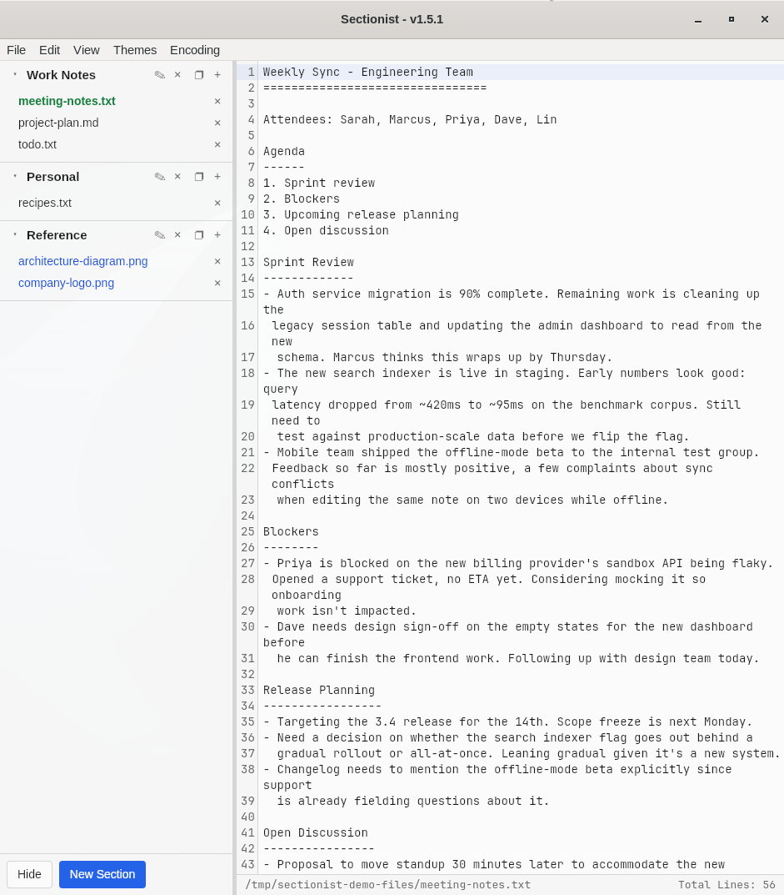

# Sectionist

Sectionist is a cross-platform desktop text editor for Windows and Linux, built around **sections** instead of traditional editor tabs.



## Why sections instead of tabs?

A section is a named collection of file references — for example "Music", "My Notes to Self", "Tech Notes", or "Sport Notes". The files in a section can live anywhere on disk; they don't need to share a folder, drive, or project. Sectionist doesn't copy or move anything — it just keeps a reference to each file so you can group related notes and documents together and get back to them quickly, without hunting through folders or a pile of open tabs.

The section browser on the left is the only navigation mechanism — there's no second tab bar to keep in sync with it.

## Features

- **Sections** — create, rename, close, and reorder (drag-and-drop) named groups of files. Each section can be expanded or collapsed, and its order/state is remembered across restarts.
- **File references, not copies** — add a file via the `+` picker or by dragging it in. Adding the same file twice switches to the existing entry instead of duplicating it. Removing a file from a section (or closing the section entirely) never touches the file on disk.
- **Editable and launchable files** — `.txt` and `.md` files open directly in the built-in editor. Other file types (PDFs, spreadsheets, images, etc.) can still be added to a section as "launchable" files, shown in blue, which open in your OS's default application for that file type.
- **Unsaved file buffers** — a New File button in each section (and `File > New`/Ctrl+N) creates a Notepad++-style in-memory "Unsaved file N" buffer with no disk location yet. It persists across a restart like any other unsaved edit, and only touches disk once you Save or Save As.
- **Custom spell check** — Edit > Spell Check (off by default) underlines misspelled words the moment a file is opened, not just as you type, via a bundled in-app dictionary rather than the browser engine's own checker. Right-click a misspelled word for suggestions, plus Notepad++-style "Ignore" (for the session) and "Add to Dictionary" (persists across restarts).
- **Encoding detection and conversion** — opening a file auto-detects UTF-8, UTF-8 with BOM, UTF-16 LE/BE, or a legacy codepage (Windows-1252, Windows-1251, Shift-JIS/CP932), and the Encoding menu lets you change a file's encoding, with full undo/redo support.
- **Themes and fonts** — switch between several editor color themes (Light, Dark, Programmer, VS Code) and a choice of editor fonts, both remembered across restarts.
- **A focused text editor** — line numbers, find/replace, undo/redo, word wrap, and zoom, all with CodeMirror underneath. Markdown files can be toggled between the normal editable view and a sanitized, rendered preview.
- **Data safety** — saves are atomic (write-to-temp-then-rename), external file changes and files that go missing are detected and surfaced rather than silently overwritten or merged, and unsaved edits are recovered if the app closes unexpectedly.
- **Native menus** — File, Edit, View (including Collapse/Expand All Sections and a Font submenu), Themes, and Encoding, wired to real OS menu shortcuts.

## What Sectionist is not

There's intentionally no project/workspace concept and no second tab strip. The goal is a simple, reliable way to keep loosely related files organized and close at hand — not a general-purpose IDE.

## Current status

Sectionist is early and functional: sections, file management, editing, saving, persistence, spell check, and multi-encoding support all work end-to-end on Linux, with Windows and Linux Mint as the primary target platforms.

See `TODO.md` for the backlog and known limitations, and `CHANGELOG.md` for a detailed history of what's been built.

## Tech stack

Sectionist is built with [Tauri](https://tauri.app/) — a Rust backend for native/file-system functionality, and a small TypeScript/HTML/CSS frontend (no UI framework) using [CodeMirror](https://codemirror.net/) for the editor.

## Building from source

See `Build Instructions/` for step-by-step guides for each distribution target (Linux AppImage, `.deb`, `.rpm`, and Windows installer/`.exe` or portable/standalone `.exe`).

For local development:

```bash
cd app
npm install
npx tauri dev    # runs the app with hot-reload (starts the Vite dev server automatically)
npm run build    # type-checks and builds the frontend
npm test         # runs the automated test suite (Vitest)
```
